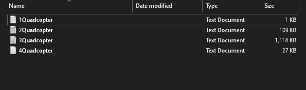
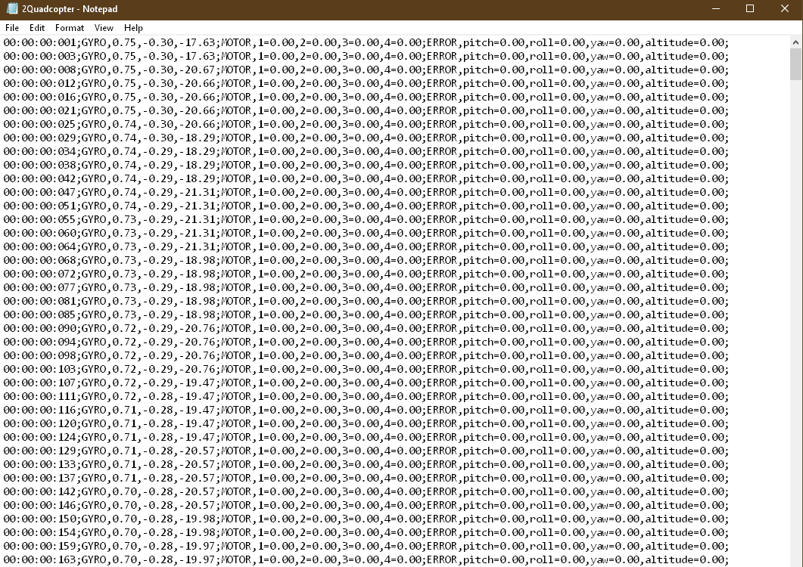

# STM32-SD logger

Spi slave that acts as an interface to a sd card. Max spi speed 300Kb/s. Has commands for low level control of the sd card and higher level commands that just setup everything for logging.

Uses bit bang spi due to the Hal's slave spi implementation being crap. This caps it to a low spi speed but that is still enough to log data at a useful rate in real time. I got 120 characters strings sending at 234 Hz using my quadcopter.

An example of how the transfer look like when transferring 120 bytes:

How the sd card folder looks like:

How the file looks like with quadcopter data i logged:

