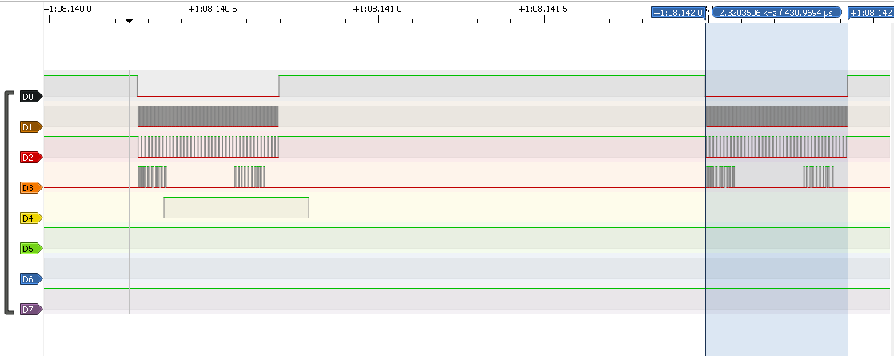
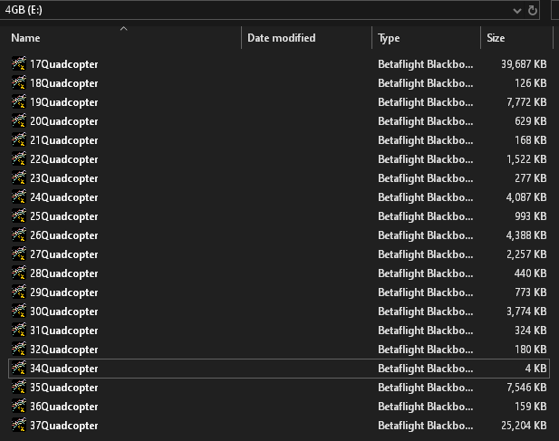
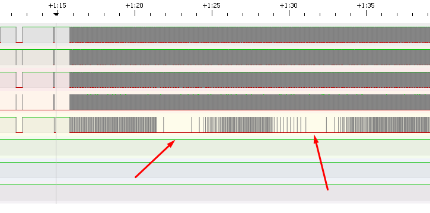
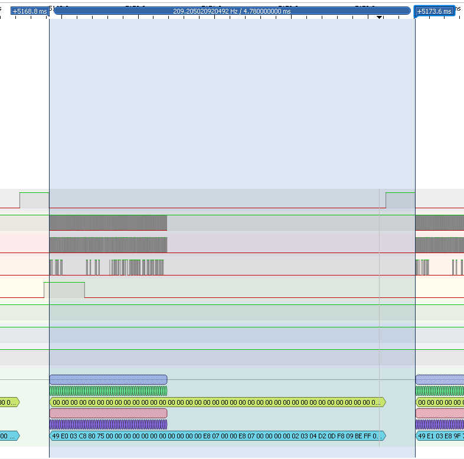

# STM32-SD logger

SPI slave that acts as an interface to an SD card. Max SPI speed 780Kb/s with DMA mode and speed of 390Kb/s using bit bang mode. It supports low level commands for control of the SD card and has high level commands that just set it up for logging.

SD cards with more than 4GB of storage need to be partitioned to use FAT32 or something to make it work. Same deal as with 3D printers. SDXC are not supported. Use ChatGpt to figure out how to do that

The current version supports DMA SPI slave functionality that lets the data be written to the SD card while it is also received at the same time from the master to the slave buffers.

The old version used bit bang spi slave functionality. Interrupts were triggered on clk pin and slave select pin to receive and transmit data. This approach actually worked well but I was uncertain it could handle my future needs of higher demand systems of logging.

An example of how the transfer looks like when transferring 50 bytes in async mode from the master to the slave:

An example of the data written to the SD Card:

You may also experience the SD card not writing all data if it is sent rapidly, this is because of the fatfs library slowing things down and not writing for some random periods. The slow down looks like this:

## Some examples from the bit bang SPI functionality

This is also some example of the old functionality of the bit bang spi slave:

An example of how the transfer look like when transferring 120 bytes:

How the sd card folder looks like:

How the file looks like with quadcopter data i logged:

